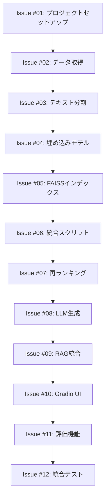

# Wikipedia RAG システム

日本語Wikipediaを使った検索拡張生成（RAG）システムです。質問を入力すると、関連するWikipedia記事を検索し、その情報に基づいて回答を生成します。

## 🚀 クイックスタート

### Option 1: GitHub Issues を使った段階的学習（推奨）

このプロジェクトは学習用に設計されており、12個のステップに分割されています。

#### 📋 Issues の自動作成

1. [Actions タブ](../../actions) へ移動
2. **Convert Issues to GitHub Issues** ワークフローを選択
3. **Run workflow** をクリック
4. **Create all issues at once** にチェック ✅
5. **Run workflow** を実行

これで12個のIssueが作成され、段階的に学習を進められます！

詳細な使い方は → [GitHub Workflow ガイド](docs/github-workflow-guide.md)

#### 🎯 学習フローチャート



### Option 2: 直接実装

上級者向け：Issueを使わずに直接実装したい場合

```bash
# 1. 環境セットアップ
git clone <repository-url>
cd wikipedia_rag
pip install -r requirements.txt

# 2. インデックス構築
python src/build_wiki_index.py --max_articles 1000

# 3. 質問応答テスト
python src/rag_wiki.py -q "織田信長について教えて"

# 4. Web UI起動
python src/app_wiki.py
```

## 🌟 特徴

- **🎓 学習重視**: 各機能を段階的に実装して理解を深める
- **🇯🇵 完全日本語対応**: 日本語Wikipediaデータを使用
- **🔍 高精度検索**: E5埋め込み + BGE再ランカーによる2段階検索
- **📚 出典明示**: すべての回答に参照情報を付与
- **🖥️ 簡単デプロイ**: Gradio UIでローカル・クラウド両対応
- **📊 評価機能**: Recall@K指標による客観的性能測定

## 📋 システム要件

### ハードウェア要件
- **RAM**: 8GB以上推奨（4GB最低）
- **Storage**: 10GB以上の空き容量
- **GPU**: 任意（あれば高速化）

### ソフトウェア要件
- Python 3.10以上
- pip または conda

## 🎯 学習目標

このプロジェクトを通じて以下の技術を習得できます：

### 📚 基礎技術
- Hugging Face 生態系の活用
- ベクトル検索とFAISSの使い方
- 自然言語処理の前処理技術

### 🔬 RAG技術
- 埋め込みモデル（E5）の活用
- Cross-encoder再ランキング
- プロンプトエンジニアリング
- 検索拡張生成アーキテクチャ

### 🛠️ システム開発
- CLI ツールの設計・実装
- Web UI開発（Gradio）
- パイプライン設計
- 統合テスト・評価手法

## 📊 予想学習時間

| フェーズ | Issue範囲 | 内容 | 予想時間 |
|----------|-----------|------|----------|
| **フェーズ1** | #01-03 | 基盤構築 | 1-2時間 |
| **フェーズ2** | #04-06 | 検索システム | 2-3時間 |
| **フェーズ3** | #07-09 | 生成システム | 2-3時間 |  
| **フェーズ4** | #10-12 | UI・評価・統合 | 2-3時間 |
| **合計** | | | **7-11時間** |

各Issueは15-30分で完了できるよう設計されています。

## 🤝 学習支援

### 📖 ドキュメント
- [GitHub Workflow ガイド](docs/github-workflow-guide.md)
- [セットアップガイド](docs/setup_guide.md) (作成予定)
- [トラブルシューティング](docs/troubleshooting.md) (作成予定)

### 💬 サポート
困った時は以下の方法でサポートを受けられます：
- 各Issueのコメント欄で質問
- [@RentoYabuki06](https://github.com/RentoYabuki06) にメンション
- Discussionsでの技術相談

## 🏆 完成イメージ

プロジェクト完了時には以下が動作します：

### CLI（コマンドライン）
```bash
$ python src/rag_wiki.py -q "大政奉還について教えて"

==================================================
質問: 大政奉還について教えてください
==================================================
回答: 大政奉還は、1867年（慶応3年）10月14日に江戸幕府第15代将軍徳川慶喜が政権を朝廷に返上した政治的事件です。これにより江戸時代が終わり、明治維新へと繋がりました。

参照: [0] jawiki:大政奉還#chunk=1, [1] jawiki:徳川慶喜#chunk=5
==================================================
```

### Web UI
Gradioベースの使いやすいWebインターフェース：
- 質問入力ボックス
- リアルタイム回答生成
- 参照情報の表示
- 設定パラメータの調整

## 📄 ライセンス

このプロジェクトはMITライセンスの下で公開されています。

## 🙏 謝辞

- Hugging Face Transformers
- FAISS by Facebook Research  
- Gradio team
- Wikipedia contributors

---

## 🚀 今すぐ始める

**学習を開始するには:**
1. 📋 [Issues の自動作成](#-issues-の自動作成) を実行
2. 🎯 Issue #01 から順番に進める
3. 💬 困った時はIssueコメントで質問

**質問がある場合:**
- 💭 [Discussions](../../discussions) で相談
- 📧 [@RentoYabuki06](https://github.com/RentoYabuki06) にメンション

楽しい学習の旅を始めましょう！ 🎉